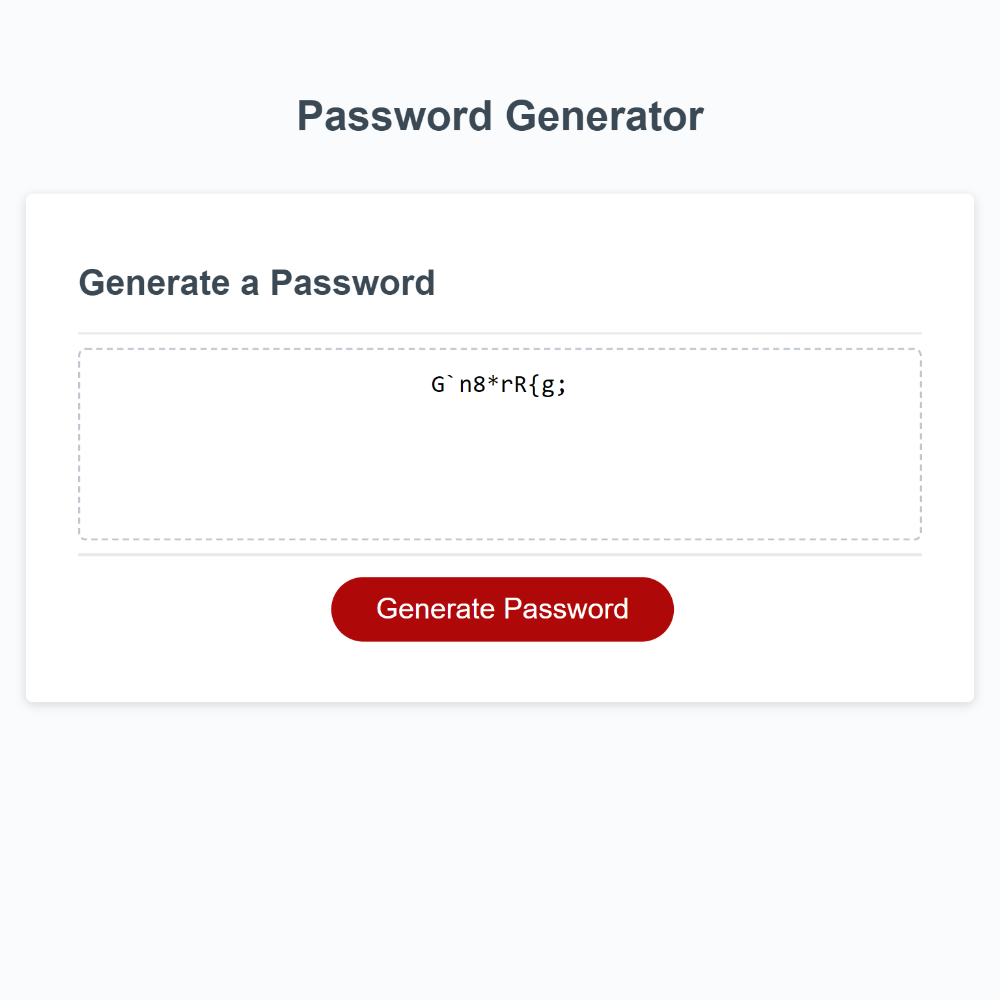

# Password Generator Starter Code
Project Title: Javascript Random Password Generator

Description: Simple random passsword generator made with javascript. It makes a random password based on the prompts the user enters. it contains upper and lower case letters, as well as numbers and symbols to create a strong password. If the user decides to not use numbers, for example, the user can press cancel on the given prompt to make a password that fits the requirements.

How to Use: There is no installation required. You can access the project using the provided link, or you can copy this repository to better understand the development of the website.
To use, enter the desired length for your password, and answer the following prompts based on your needs. After going through the prompts, the password will be printed in the given box for the user to copy.

-Website link: https://piersalloum.github.io/Javascript-Random-Password-Generator/

References:
-https://stackoverflow.com/questions/1497481/javascript-password-generator
-https://www.geeksforgeeks.org/how-to-generate-a-random-password-using-javascript/
-https://www.w3schools.com/jsref/jsref_random.asp
-https://morioh.com/p/a155d75129d4

Screenshot of the website:

License:

MIT License

Copyright (c) [2023] [PierSalloum]

Permission is hereby granted, free of charge, to any person obtaining a copy of this software and associated documentation files (the "Software"), to deal in the Software without restriction, including without limitation the rights to use, copy, modify, merge, publish, distribute, sublicense, and/or sell copies of the Software, and to permit persons to whom the Software is furnished to do so, subject to the following conditions:

The above copyright notice and this permission notice shall be included in all copies or substantial portions of the Software.

THE SOFTWARE IS PROVIDED "AS IS", WITHOUT WARRANTY OF ANY KIND, EXPRESS OR IMPLIED, INCLUDING BUT NOT LIMITED TO THE WARRANTIES OF MERCHANTABILITY, FITNESS FOR A PARTICULAR PURPOSE AND NONINFRINGEMENT. IN NO EVENT SHALL THE AUTHORS OR COPYRIGHT HOLDERS BE LIABLE FOR ANY CLAIM, DAMAGES OR OTHER LIABILITY, WHETHER IN AN ACTION OF CONTRACT, TORT OR OTHERWISE, ARISING FROM, OUT OF OR IN CONNECTION WITH THE SOFTWARE OR THE USE OR OTHER DEALINGS IN THE SOFTWARE.
